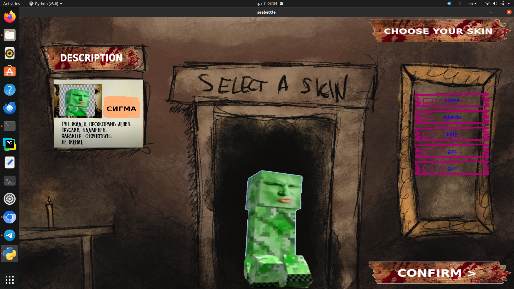
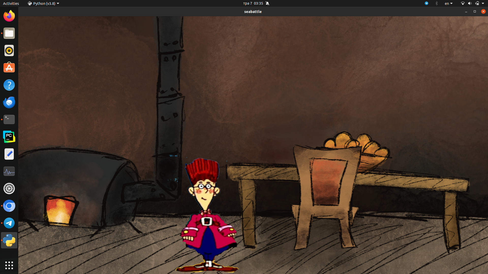
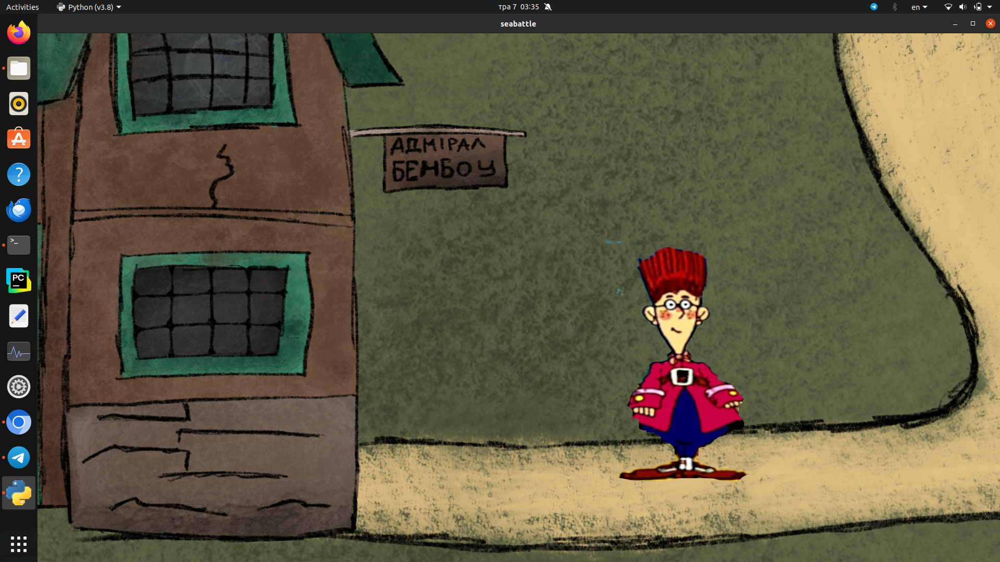

# SEA BATTLE



## 🤨 Навіщо ?:
це крута, не весела і цікава гра.

## 🤓 Опис:
- це гра за мотивами радянського острова скарбів, але переосмислена. також це незавершена гра. тут доступна демо версія. але повної гри можливо ніколи і не буде... це сумно... але так сталось...

## ☠️ Використані технології:
- все написано на PYTHON
- вся графіка на KIVY

## 🌱 Структура проекта:
- `design/` — дизайн гри
- `images/` — системні фото і спрайти для роботи гри
- `modules/` — модулі із логікою
- `screenshots/` — скріншори гри, непотрібні для роботи
- `sound/` — системні звуки для роботи гри
- `videos/` — системні відео для роботи гри
- `main.py` — головний файл запуска гри

## 😎 Як це запустити ?:
1. встановлюємо необхідні пакети
```bash
sudo apt update
sudo apt install python3
sudo apt install python3-pip python3-dev libsdl2-dev libsdl2-image-dev libsdl2-mixer-dev libsdl2-ttf-dev libportmidi-dev libswscale-dev libavformat-dev libavcodec-dev zlib1g-dev libgstreamer1.0-0 gstreamer1.0-plugins-base gstreamer1.0-plugins-good
pip install "kivy[base]"
```
2. запускаємо утиліту
```bash
python3 main.py
```

## ⚠️ ПОПЕРЕДЖЕННЯ:
- графіка і спрайти не мої.

## ✨ Ось іще скріншоти:



## ❓ Швидкі питання і відповіді
1. "чому так пусто і сумно ка карті ?" - "бо це дійсно екзистинційна пустота заброшеної гри. це як велична але покинута будівля."
